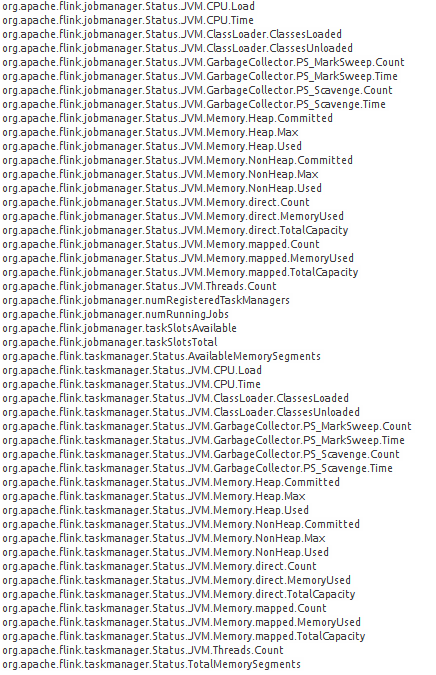
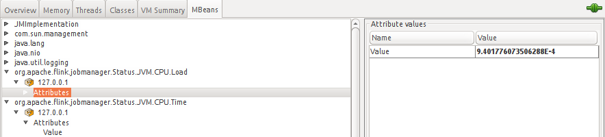
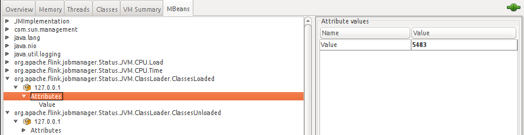

# Introduction
The current solution shows how to collect, store and plot time-series data about metrics related to
resources consumed by jobs and tasks executed by flink. For this purpose, a general scheme had beeen
tested, it is presented in the figure below.

[alt text](img/FlinkMonitorArchitecture.png)

## File Scheduled Reporter
### Flink Configuration
In the next configuration metrics scopes may be vanished.
```

#=================================
#
#METRICS
#
#=================================
metrics.scope.jm: localhost.myhost
metrics.scope.jm.job: localhost.jobmanager.myjm
metrics.scope.tm: localhost.taskmanager.mytm
metrics.scope.tm.job: localhost.mytm.myjob
metrics.scope.task: localhost.taskmanager.mytm.myjob.mytask.idtask

metrics.reporters: inet_reporter
# #specifying the class for the internal reporter
metrics.reporter.inet_reporter.class: berlin.bbdc.inet.flinkReporter.FileFlinkReporter
metrics.reporter.inet_reporter.interval: 10 MILLISECONDS
#path for writing the metric file
metrics.reporter.inet_reporter.path: /tmp/metrics/
#Graphite server configuration
metrics.reporter.inet_reporter.host: localhost
metrics.reporter.inet_reporter.port: 2003
metrics.reporter.inet_reporter.protocol: TCP
```
## Package project
```
mvn package -DskipTests
```
## Debug flink
File ${FLINK_DIR}/conf/log4j.properties
```
log4j.rootLogger=DEBUG, file
```
## Flink lib dependency
```
cp target/wordcountMetrics-0.1.jar $FLINK/lib/
```
## Expectation
```
2017-02-11 15:15:58,099 DEBUG org.apache.hadoop.metrics2.impl.MetricsSystemImpl             - UgiMetrics, User and group related metrics
2017-02-11 15:15:58,427 INFO  org.apache.flink.runtime.jobmanager.JobManager                -  Classpath: /home/dgu/developer/myflink/lib/flink-dist_2.10-1.2-SNAPSHOT.jar:/home/dgu/developer/myflink/lib/flink-metrics-graphite-1.2-SNAPSHOT.jar:/home/dgu/developer/myflink/lib/flink-python_2.10-1.2-SNAPSHOT.jar:/home/dgu/developer/myflink/lib/log4j-1.2.17.jar:/home/dgu/developer/myflink/lib/slf4j-log4j12-1.7.7.jar:/home/dgu/developer/myflink/lib/wordcountMetrics-0.1.jar:::
2017-02-11 15:15:58,616 DEBUG org.apache.flink.configuration.GlobalConfiguration            - Loading configuration property: metrics.scope.jm, localhost.myhost
2017-02-11 15:15:58,617 DEBUG org.apache.flink.configuration.GlobalConfiguration            - Loading configuration property: metrics.scope.jm.job, localhost.jobmanager.myjm
2017-02-11 15:15:58,617 DEBUG org.apache.flink.configuration.GlobalConfiguration            - Loading configuration property: metrics.scope.tm, localhost.taskmanager.mytm
2017-02-11 15:15:58,617 DEBUG org.apache.flink.configuration.GlobalConfiguration            - Loading configuration property: metrics.scope.tm.job, localhost.mytm.myjob
2017-02-11 15:15:58,617 DEBUG org.apache.flink.configuration.GlobalConfiguration            - Loading configuration property: metrics.scope.task, localhost.taskmanager.mytm.myjob.mytask.idtask
2017-02-11 15:15:58,617 DEBUG org.apache.flink.configuration.GlobalConfiguration            - Loading configuration property: metrics.reporters, inet_reporter
2017-02-11 15:15:58,617 DEBUG org.apache.flink.configuration.GlobalConfiguration            - Loading configuration property: metrics.reporter.inet_reporter.class, berlin.bbdc.inet.flinkReporter.FileFlinkReporter
2017-02-11 15:15:58,617 DEBUG org.apache.flink.configuration.GlobalConfiguration            - Loading configuration property: metrics.reporter.inet_reporter.interval, '10 MILLISECONDS'
2017-02-11 15:15:58,633 DEBUG org.apache.flink.configuration.GlobalConfiguration            - Loading configuration property: metrics.scope.jm, localhost.myhost
2017-02-11 15:15:58,633 DEBUG org.apache.flink.configuration.GlobalConfiguration            - Loading configuration property: metrics.scope.jm.job, localhost.jobmanager.myjm
2017-02-11 15:15:58,634 DEBUG org.apache.flink.configuration.GlobalConfiguration            - Loading configuration property: metrics.scope.tm, localhost.taskmanager.mytm
2017-02-11 15:15:58,634 DEBUG org.apache.flink.configuration.GlobalConfiguration            - Loading configuration property: metrics.scope.tm.job, localhost.mytm.myjob
2017-02-11 15:15:58,634 DEBUG org.apache.flink.configuration.GlobalConfiguration            - Loading configuration property: metrics.scope.task, localhost.taskmanager.mytm.myjob.mytask.idtask
2017-02-11 15:15:58,634 DEBUG org.apache.flink.configuration.GlobalConfiguration            - Loading configuration property: metrics.reporters, inet_reporter
2017-02-11 15:15:58,634 DEBUG org.apache.flink.configuration.GlobalConfiguration            - Loading configuration property: metrics.reporter.inet_reporter.class, berlin.bbdc.inet.flinkReporter.FileFlinkReporter
2017-02-11 15:15:58,634 DEBUG org.apache.flink.configuration.GlobalConfiguration            - Loading configuration property: metrics.reporter.inet_reporter.interval, '10 MILLISECONDS'

```
```
2017-02-11 17:14:52,986 DEBUG berlin.bbdc.inet.flinkReporter.FileFlinkReporter              - INET - Metrics - added: localhost.taskmanager.mytm.Status.JVM.ClassLoader.ClassesUnloaded
2017-02-11 17:14:52,986 DEBUG berlin.bbdc.inet.flinkReporter.FileFlinkReporter              - INET - Metrics - added: localhost.taskmanager.mytm.Status.JVM.GarbageCollector.PS Scavenge.Count
2017-02-11 17:14:52,986 DEBUG berlin.bbdc.inet.flinkReporter.FileFlinkReporter              - INET - Metrics - added: localhost.taskmanager.mytm.Status.JVM.GarbageCollector.PS Scavenge.Time
2017-02-11 17:14:52,986 DEBUG berlin.bbdc.inet.flinkReporter.FileFlinkReporter              - INET - Metrics - added: localhost.taskmanager.mytm.Status.JVM.GarbageCollector.PS MarkSweep.Count
2017-02-11 17:14:52,986 DEBUG berlin.bbdc.inet.flinkReporter.FileFlinkReporter              - INET - Metrics - added: localhost.taskmanager.mytm.Status.JVM.GarbageCollector.PS MarkSweep.Time

```

### Results
```
localhost.myhost.numRunningJobs.csv
localhost.myhost.Status.JVM.ClassLoader.ClassesLoaded.csv
localhost.myhost.Status.JVM.ClassLoader.ClassesUnloaded.csv
localhost.myhost.Status.JVM.CPU.Load.csv
localhost.myhost.Status.JVM.CPU.Time.csv
localhost.myhost.Status.JVM.GarbageCollector.PS MarkSweep.Count.csv
localhost.myhost.Status.JVM.GarbageCollector.PS MarkSweep.Time.csv
localhost.myhost.Status.JVM.GarbageCollector.PS Scavenge.Count.csv
localhost.myhost.Status.JVM.GarbageCollector.PS Scavenge.Time.csv
localhost.myhost.Status.JVM.Memory.direct.Count.csv
localhost.myhost.Status.JVM.Memory.direct.MemoryUsed.csv
localhost.myhost.Status.JVM.Memory.direct.TotalCapacity.csv
localhost.myhost.Status.JVM.Memory.Heap.Committed.csv
localhost.myhost.Status.JVM.Memory.Heap.Max.csv
localhost.myhost.Status.JVM.Memory.Heap.Used.csv
localhost.myhost.Status.JVM.Memory.mapped.Count.csv
localhost.myhost.Status.JVM.Memory.mapped.MemoryUsed.csv
localhost.myhost.Status.JVM.Memory.mapped.TotalCapacity.csv
localhost.myhost.Status.JVM.Memory.NonHeap.Committed.csv
```
### Measurements
```
@:/tmp$ cat localhost.myhost.numRunningJobs.csv
t,value
1486899737,0
1486899738,0
1486899739,0
1486899740,0

```
## Graphite
### Pre-requisites
Python and pip
```
sudo apt install python-setuptools python-dev build-essential
sudo apt install python-pip
pip install --upgrade pip
```
Repositories
```
mkdir ~/graphite
cd ~/graphite
git clone https://github.com/graphite-project/graphite-web.git
git clone https://github.com/graphite-project/carbon.git
git clone https://github.com/graphite-project/whisper.git
```
Libraries
```
pip install whisper
pip install pyparsing==1.5.1
pip install tagging
pip install cairocffi
pip install Django==1.9
pip install django-cms
pip install django-tagging==0.4.3
pip install pytz
pip install whitenoise
pip install mod_wsgi
pip install Twisted==11.1.0
pip install carbon
apt install apache2
apt install apache2-dev libapache2-mod-wsgi
pip install scandir
pip install graphite-web
pip install mod_wsgi
```
### Installation
In ~/graphite/graphite-web
```
cd ~/graphite/graphite-web
python setup.py install
```
Default installation $GRAPHITE_ROOT==/opt/graphite
```
sudo chmod -R 777 /opt/graphite/
sudo chown -R <your username>:staff /opt/graphite
cp /opt/graphite/conf/carbon.conf{.example,}
cp /opt/graphite/conf/storage-schemas.conf{.example,}
cp /opt/graphite/conf/graphite.wsgi{.example,}
cp /opt/graphite/conf/graphTemplates.conf{.example,}
cp /opt/graphite/conf/dashboard.conf{.example,}
cp /opt/graphite/conf/whitelist.conf{.example,}
cd /opt/graphite/webapp/graphite
cp local_settings.py{.example,}
PYTHONPATH=/opt/graphite/webapp django-admin.py migrate --settings=graphite.settings --run-syncdb

```
### Testing
```
python /opt/graphite/bin/carbon-cache.py start
python /opt/graphite/bin/run-graphite-devel-server.py /opt/graphite
```
### Browsing
```
http://localhost:8080/
```
### Creating a graph
```
Login 
User: hduser
Passwd: hduser

```

### Dashboard
Graph example
```
http://localhost:8087/dashboard/#Example-SocketWindow-Data-Processing

```
In the following URL, we can configure all the numerical series we would like to display just by clicking on it. In the menu Dashboard we can find the options related to Graphs Edit, Save, Import, etc.
```
http://localhost:8087/dashboard
```
<!--## Limitations-->
<!--This solution is limited to Java Virtual Machine Management interfaces implementations; however, it is versatile enough to query third and application layer protocols such as-->
<!--UDP, TCP and JSON Objects. It can be achieved throughout Carbon, decoupling all the JMX transactions.-->

<!--## Tools, Frameworks and Modules-->
<!--### JMX-->
<!--Java Management eXtensions is a technology that lets you implement management interfaces for Java applications. A management interface, -->
<!--as defined by JMX, is composed of named objects - called MBeans (Management Beans).-->
<!--MBeans are registered with a name (an ObjectName) in an MBeanServer.-->

<!---->

<!--### Flink Metrics-->
<!--Apache Flink exposes a metric system that allows gathering and exposing metrics to external systems under the -->
<!--project called flink-metrics under the [version 1.3-SNAPSHOT.](https://github.com/apache/flink/tree/master/flink-metrics)-->
<!--[Further details about flink metrics.](https://ci.apache.org/projects/flink/flink-docs-release-1.1/apis/metrics.html)-->
<!--The current Apache Flink's implementation is limited to the next objects:-->
<!---->
<!--As we can notice, we could gather metrics from flink's jobmanager and taskmanager objects.-->

<!--#### JobManager and TaskManager Status CPU-->
<!--- CPU.Load	The recent CPU usage of the JVM.-->
<!--- CPU.Time	The CPU time used by the JVM.-->

<!---->

<!--#### JobManager and TaskManager Status ClassLoader-->
<!--- ClassLoader.ClassesLoaded	The total number of classes loaded since the start of the JVM.-->
<!--- ClassLoader.ClassesUnloaded	The total number of classes unloaded since the start of the JVM.-->

<!---->
<!--#### Objects to Track Jobs and Tasks-->
<!--- currentLowWatermark	The lowest watermark a task has received.-->
<!--- lastCheckpointDuration	The time it took to complete the last checkpoint.-->
<!--- lastCheckpointSize	The total size of the last checkpoint.-->
<!--- restartingTime	The time it took to restart the job.-->
<!--- numBytesInLocal	The total number of bytes this task has read from a local source.-->
<!--- numBytesInRemote	The total number of bytes this task has read from a remote source.-->
<!--- numBytesOut	The total number of bytes this task has emitted.-->
<!--- Operator	numRecordsIn	The total number of records this operator has received.-->
<!--- numRecordsOut	The total number of records this operator has emitted.-->
<!--- numSplitsProcessed	The total number of InputSplits this data source has processed (if the operator is a data source).-->
<!--- latency	A latency gauge reporting the latency distribution from the different sources.-->

<!--### Twisted-->
<!--Twisted is an event-driven networking engine written in Python, Twisted is designed for complete-->
<!--separation between logical protocols (usually relying on-->
<!--stream-based connection semantics, such as HTTP or POP3) and physical transport layers -->
<!--supporting such stream-based semantics (such as files, sockets or SSL libraries). -->
<!--Connection between a logical protocol and a transport layer happens at the last possible moment — -->
<!--just before information is passed into the logical protocol instance.[Reference](https://twistedmatrix.com/trac/)-->

<!--### The pickle protocol-->
<!--This is a protocol which supports sending batches of metrics to Carbon in one go.-->

<!--### Django-->
<!--Free and open-source web framework, written in Python,-->
<!--which follows the model-view-template (MVT) architectural pattern, in this case used as a webapp container for-->
<!--graphite.[Reference](https://en.wikipedia.org/wiki/Django_(web_framework))-->

<!--# Description -->
<!--JMXTransformer (jmxtrans) is the module which is querying the JVM JMX Server. It is executing queries to Java Object Names, managed beans -->
<!--contained in the MBeanServer in each Java Virual Machine, e.g. org.apache.flink.jobmanager.Status.JVM.CPU.Load, each query is defined for an attribute value in a specific -->
<!--host and port. Then, JMXTransformer uses an implementation of an OutputWriter, [GraphiteWriterFactory](https://github.com/jmxtrans/jmxtrans/blob/master/jmxtrans-output/jmxtrans-output-core/src/main/java/com/googlecode/jmxtrans/model/output/GraphiteWriterFactory.java#L57), -->
<!--to send a metric through a TCP connection to Graphite, specifically to Carbon module. Carbon is responsible for receiving metrics over the network, it is able to cache this metrics-->
<!--and save it to disk, using Whisper time-series library. Whisper is the responsible to storage numeric data over time, it controls the resolution of the metrics data. In our specific case, numeric data is being-->
<!--storaged in a SQLite database. Finally, the Django Graphite web application is able to retrieve the information to render time-series data in the graphite web workspace .-->
<!---->

<!--## Graphite-->
<!--Graphite stores numeric time-series data and renders graphics of this data on demand.-->

<!---->

<!--What Graphite does not do is collect data for you, however there are some tools out there that know how to send data to graphite. -->
<!--Even though it often requires a little code, sending data to Graphite is very simple.-->

<!--Reference and more info : https://graphiteapp.org/-->

<!--### Graphite over Flink JMX Server-->
<!--The graphite webapp is in the end collecting, saving and plotting all the time series data-->
<!--that we configure to pull from a JMX Server in each Java Virtual Machine. Specifically, the system is querying constantly to -->
<!--MBeans objects. To give a glance, we could start a Java utility called Jconsole and connect to a remote/local JVM where flink is running.-->

<!--## Carbon & Whisper-->
<!--Carbon is a twisted daemon that listens for time-series data. Source code, guidelines and wiki: https://github.com/graphite-project/carbon -->
<!--On the other hand, Whisper is simple database library for storing time-series data. [Source code and wiki.](https://github.com/graphite-project/whisper) -->

<!---->

<!--## JMXTransformer-->
<!--The transformer jmxtrans is a tool which allows us to connect to any number of Java Virtual Machines (JVMs) and query them-->
<!--for their attributes. The attributes are exported from the JVM via Java Management Extensions (JMX). The query language is based on JSON format.-->
<!--[Source code, guides and wiki.](https://github.com/jmxtrans/jmxtrans) -->
<!---->


<!--# Installation Guide-->
<!--The current installation guide was developed in an Ubuntu-16 machine.-->

<!--## Pre-requisites-->
<!--- a UNIX-like Operating System-->
<!--- Git-->
<!--- Java version "1.8.0_111"-->
<!--- Python 2.7 or greater but NOT Python 3-->
<!--- Apache Flink Latest stable release (v1.1.4) -->
<!--- cairocffi-->
<!--- Django 1.5-->
<!--- django-tagging 0.3-->
<!--- pytz-->
<!--- fontconfig and at least one font package (a system package usually)-->
<!--- A WSGI server and web server. Popular choices are:-->
<!--- Apache with mod_wsgi-->
<!--- gunicorn with nginx-->


<!--### Cairo-->
<!--```-->
<!--sudo pip install cairocffi-->
<!--```-->
<!--### Django -->
<!--```-->
<!--sudo pip install Django==1.5-->
<!--```-->
<!--### Django Tagging -->
<!--```-->
<!--sudo pip install django-tagging==0.3-->
<!--```-->
<!--### Pytz -->
<!--```-->
<!--sudo pip install pytz-->
<!--```-->
<!--### Whitenoise-->
<!--```-->
<!--sudo pip install whitenoise-->
<!--```-->
<!--### Web Server Gateway Interface-->
<!--```-->
<!--sudo pip install mod_wsgi-->
<!--```-->
<!--### Twisted-->
<!--```-->
<!--sudo pip install Twisted==11.1.0-->
<!--```-->
<!--### Apache2-->
<!--```-->
<!--sudo apt install apache2-->
<!--```-->
<!--### Apache Toolkit -->
<!--```-->
<!--sudo apt install apache2-dev libapache2-mod-wsgi-->
<!--```-->
<!--### JMXTrans-->
<!--1. Download the .deb package. In this case version 260 was used. [Packages](http://central.maven.org/maven2/org/jmxtrans/jmxtrans/)-->
<!--2. As root (replace the version number):  -->
<!--``` -->
<!--sudo dpkg -i jmxtrans_2 39-1_amd64.deb-->
<!--```-->
<!--3. JVM heap size: 512 (megs) is the default. The more JVMs we need to monitor, the more memory we will probably need. If getting OutOfMemoryError, then we will have to increase this value by editing /etc/default/jmxtrans.-->

<!--### Graphite -->
<!--This installation is based on the section "Installing from source" found in [graphite readthedocs,](http://graphite.readthedocs.io/en/latest/install-source.html) and supported by the forums like [digital ocean manual,](https://www.digitalocean.com/community/tutorials/how-to-install-and-use-graphite-on-an-ubuntu-14-04-server)-->
<!--[linux administration guide,](http://www.linux-admins.net/2012/02/how-to-install-and-use-graphite.html) and [installing Graphite in OS X Mavericks](https://gist.github.com/relaxdiego/7539911)-->

<!--```-->
<!--mkdir ~/graphite-->
<!--cd ~/graphite-->
<!--git clone https://github.com/graphite-project/graphite-web.git-->
<!--```-->
<!--To install Graphite in the default location, /opt/graphite/, simply execute python setup.py install as root in each of the project directories for Graphite-web, Carbon, and Whisper.-->
<!--```-->
<!--cd ~/graphite-->
<!--sudo python setup.py install-->
<!--```-->
<!--Graphite-web’s setup.py installer is configured to use a prefix of /opt/graphite and an install-lib of /opt/graphite/webapp.-->
<!--Utilities are installed in bin, and configuration in conf within the prefix. These may be overridden by passing parameters to setup.py install-->

<!--The following parameters influence the install location:-->

<!--- --prefix-->
<!--    -Location to place the bin/ and conf/ directories (defaults to /opt/graphite/)-->
<!--- --install-lib-->
<!--    - Location to install Python modules (default: /opt/graphite/webapp)-->
<!--- --install-data-->
<!--    - Location to place the webapp/content and conf directories (default: value of prefix)-->
<!--- --install-scripts-->
<!--    - Location to place scripts (default: bin/ inside of prefix)-->

<!--### Carbon-->
<!--```-->
<!--mkdir ~/carbon-->
<!--cd ~/carbon-->
<!--git clone https://github.com/graphite-project/carbon.git-->
<!--sudo python setup.py-->
<!--```-->
<!--Carbon’s setup.py installer is configured to use a prefix of /opt/graphite and an install-lib of /opt/graphite/lib. -->
<!--Carbon’s lifecycle wrapper scripts and utilities are installed in bin, configuration within conf, and stored data in storage all within prefix.-->
<!--These may be overridden by passing parameters to the setup.py install command.-->

<!--# Configuration Guide-->
<!--## Flink Configuration-->
<!--Flink configuration for enabling JMXServer set up in file FLINK_HOME/conf/flink-conf.yaml, based on [flink-guide.](https://ci.apache.org/projects/flink/flink-docs-release-1.2/monitoring/metrics.html)-->
<!--Each of these keys expect a format string that may contain constants (e.g. “taskmanager”) and variables (e.g. “<task_id>”) which will be replaced at runtime.-->

<!--### Scope-->
<!--The system scope contains context information about the metric, for example in which task it was registered or what job that task belongs to. -->
<!--- metrics.scope.jm-->
<!--    - Default: host.jobmanager-->
<!--    - Applied to all metrics that were scoped to a job manager.-->
<!--- metrics.scope.jm.job-->
<!--    - Default: host.jobmanager.job_name-->
<!--    - Applied to all metrics that were scoped to a job manager and job.-->
<!--- metrics.scope.tm-->
<!--    - Default: host.taskmanager.tm_id-->
<!--    - Applied to all metrics that were scoped to a task manager.-->
<!--- metrics.scope.tm.job-->
<!--    - Default: host.taskmanager.tm_id.job_name-->
<!--    - Applied to all metrics that were scoped to a task manager and job.-->
<!--- metrics.scope.task-->
<!--    - Default: host.taskmanager.tm_id.job_name.task_name.subtask_index-->
<!--    - Applied to all metrics that were scoped to a task.-->
<!--- metrics.scope.operator-->
<!--    - Default: host.taskmanager.tm_id.job_name.operator_name.subtask_index-->
<!--    - Applied to all metrics that were scoped to an operator.-->

<!--### List of Variables-->
<!--- JobManager: host-->
<!--- TaskManager: host, tm_id-->
<!--- Job: job_id, job_name-->
<!--- Task: task_id, task_name, task_attempt_id, task_attempt_num, subtask_index-->
<!--- Operator: operator_name, subtask_index-->

<!--### Example used in a local host-->

<!--```-->
<!--metrics.scope.jm: localhost.jobmanager-->
<!--metrics.reporters: my_jmx_reporter-->
<!--#Specifying the class for the internal JMX reporter-->
<!--metrics.reporter.my_jmx_reporter.class: org.apache.flink.metrics.jmx.JMXReporter-->
<!--#Using the default flink port range for the default flink reporter-->
<!--metrics.reporter.my_jmx_reporter.port: 9010-9025-->
<!--```-->

<!--Note: According to this range FlinkJobManager will choose a port for each FlinkProgram if metrics were enabled by -->
<!--a FlinkProgram, otherwise it will choose automatically the port 9011 for the System Flink Metrix JMX Server.-->

<!--## JMXTrans Configuration-->

<!--- The application is installed in: /usr/share/jmxtrans-->
<!--- Configuration options are stored in: /etc/default/jmxtrans-->
<!--- There is an init script in: /etc/init.d/jmxtrans (this wraps the jmxtrans.sh discussed below)-->
<!--- The configuration .json files into: /var/lib/jmxtrans-->
<!--- To print the used memory: echo "jmxtrans jmxtrans/jvm_heap_size string 256" | sudo debconf-set-selections-->

<!--### Example for Flink in a local host-->

<!--```json-->
<!--{-->
<!--  "servers" : [ {-->
<!--    "port" : "9011",-->
<!--    "host" : "localhost",-->
<!--    "queries" : [ {-->
<!--      "obj" : "org.apache.flink.jobmanager.Status.JVM.CPU.Load:host=127.0.0.1",-->
<!--      "resultAlias": "flink-jm",-->
<!--      "attr" : [ "Value" ],-->
<!--      "outputWriters" : [ {-->
<!--        "@class" : "com.googlecode.jmxtrans.model.output.GraphiteWriterFactory",-->
<!--          "port" : 2003,-->
<!--          "host" : "localhost"-->
<!--      } ]-->
<!--    }, {-->
<!--      "obj" : "org.apache.flink.taskmanager.Status.JVM.CPU.Load:host=localhost,tm_id=717c7afcf684f5eb600026c9bdc81ac1",-->
<!--      "resultAlias": "flink-tm",-->
<!--      "attr" : [ "Value" ],-->
<!--      "outputWriters" : [ {-->
<!--        "@class" : "com.googlecode.jmxtrans.model.output.GraphiteWriterFactory",-->
<!--          "port" : 2003,-->
<!--          "host" : "localhost"-->
<!--      } ]-->
<!--    }, {-->
<!--      "obj" : "org.apache.flink.taskmanager.Status.JVM.Memory.Heap.Used:host=localhost,tm_id=717c7afcf684f5eb600026c9bdc81ac1",-->
<!--      "resultAlias": "flink-tm-mem",-->
<!--      "attr" : [ "Value" ],-->
<!--      "outputWriters" : [ {-->
<!--        "@class" : "com.googlecode.jmxtrans.model.output.GraphiteWriterFactory",-->
<!--          "port" : 2003,-->
<!--          "host" : "localhost"-->
<!--      } ]-->
<!--    } ]-->
<!--  } ]-->
<!--}-->

<!--```-->
<!--Note: an example file can be founf here in conf-files/flink.json-->


<!--## Graphite & Carbon Configuration-->
<!--### Config File for Graphite General Settings-->
<!--The file local_settings.py is generally located within the main graphite module where the webapp’s code lives. -->
<!--```-->
<!--cd /opt/graphite/webapp/graphite-->

<!--# Modify this file to change database backend (default is sqlite).-->
<!--cp local_settings.py{.example,}-->
<!--```-->
<!--### General Settings-->
<!--- TIME_ZONE-->
<!--    - Default: America/Chicago-->
<!--    - Set your local timezone. Timezone is specified using zoneinfo names.-->

<!--- DOCUMENTATION_URL-->
<!--    - Default: http://graphite.readthedocs.io/-->
<!--    - Overrides the Documentation link used in the header of the Graphite Composer.-->

<!--- LOG_RENDERING_PERFORMANCE-->
<!--    - Default: False-->
<!--    - Triggers the creation of rendering.log which logs timings for calls to the The Render URL API.-->

<!--- LOG_CACHE_PERFORMANCE-->
<!--    - Default: False-->
<!--    - Triggers the creation of cache.log which logs timings for remote calls to carbon-cache as well as Request Cache (memcached) hits and misses.-->

<!--- DEBUG = True-->
<!--    - Default: False-->
<!--    - Enables generation of detailed Django error pages. See Django’s documentation for details.-->

<!--- FLUSHRRDCACHED-->
<!--    - Default: <unset>-->
<!--    - If set, executes rrdtool flushcached before fetching data from RRD files. Set to the address or socket of the rrdcached daemon. Ex: unix:/var/run/rrdcached.sock-->

<!--- MEMCACHE_HOSTS-->
<!--    - Default: []-->
<!--    - If set, enables the caching of calculated targets (including applied functions) and rendered images. If running a cluster of Graphite webapps, each webapp should have the exact same values for this setting to prevent unneeded cache misses.-->
<!--    - Set this to the list of memcached hosts. Ex: ['10.10.10.10:11211', '10.10.10.11:11211', '10.10.10.12:11211']-->

<!--- DEFAULT_CACHE_DURATION-->
<!--    - Default: 60-->
<!--    - Default expiration of cached data and images.-->

<!--- DEFAULT_CACHE_POLICY-->
<!--    - Default: []-->
<!--    - Metric data and graphs are cached for one minute by default. If defined, DEFAULT_CACHE_POLICY is a list of tuples of minimum query time ranges mapped to the cache duration for the results. This allows for larger queries to be cached for longer periods of times. All times are in seconds. An example configuration:-->

<!--### Filesystem Paths-->
<!--- GRAPHITE_ROOT-->
<!--    - Default: /opt/graphite The base directory for the Graphite install. -->
<!--- CONF_DIR-->
<!--    - Default: GRAPHITE_ROOT/conf The location of additional Graphite-web configuration files.-->
<!--- STORAGE_DIR-->
<!--    - Default: GRAPHITE_ROOT/storage The base directory from which WHISPER_DIR, RRD_DIR, CERES_DIR, LOG_DIR, and INDEX_FILE default paths are referenced.-->
<!--- LOG_DIR-->
<!--    - Default: STORAGE_DIR/log/webapp The directory to write Graphite-web’s log files. This directory must be writable by the user running the Graphite-web webapp.-->
<!--- WHISPER_DIR-->
<!--    - Default: /opt/graphite/storage/whisper The location of Whisper data files. -->

<!--## Apache and Graphite-->
<!--File used -->
<!--```-->
<!--# Enable virtualhosts, perhaps by adding this to your server's config somewhere,-->
<!--# probably the main httpd.conf-->
<!--NameVirtualHost *:8080-->

<!--# This line also needs to be in your server's config.-->
<!--LoadModule wsgi_module modules/mod_wsgi.so-->

<!--# You need to manually edit this file to fit your needs.-->
<!--# This configuration assumes the default installation prefix-->
<!--# of /opt/graphite/, if you installed graphite somewhere else-->
<!--# you will need to change all the occurrences of /opt/graphite/-->
<!--# in this file to your chosen install location.-->

<!--<IfModule !wsgi_module.c>-->
<!--    LoadModule wsgi_module modules/mod_wsgi.so-->
<!--</IfModule>-->

<!--# XXX You need to set this up!-->
<!--# Read http://code.google.com/p/modwsgi/wiki/ConfigurationDirectives#WSGISocketPrefix-->
<!--# For example, create a directory /var/run/wsgi and use that.-->
<!--WSGISocketPrefix /var/run/wsgi-->

<!--<VirtualHost *:8080>-->
<!--        ServerName graphite-->
<!--        DocumentRoot "/opt/graphite/webapp"-->
<!--        ErrorLog /opt/graphite/storage/log/webapp/error.log-->
<!--        CustomLog /opt/graphite/storage/log/webapp/access.log common-->

<!--        # I've found that an equal number of processes & threads tends-->
<!--        # to show the best performance for Graphite (ymmv).-->
<!--        WSGIDaemonProcess graphite processes=5 threads=5 display-name='%{GROUP}' inactivity-timeout=120-->
<!--        WSGIProcessGroup graphite-->
<!--        WSGIApplicationGroup %{GLOBAL}-->
<!--        WSGIImportScript /opt/graphite/conf/graphite.wsgi process-group=graphite application-group=%{GLOBAL}-->

<!--        # XXX You will need to create this file! There is a graphite.wsgi.example-->
<!--        # file in this directory that you can safely use, just copy it to graphite.wgsi-->
<!--        WSGIScriptAlias / /opt/graphite/conf/graphite.wsgi-->


<!--        # XXX To serve static files, either:-->
<!--        # * Install the whitenoise Python package (pip install whitenoise)-->
<!--        # * Collect static files in a directory by running:-->
<!--        #     django-admin.py collectstatic --noinput --settings=graphite.settings-->
<!--        #   And set an alias to serve static files with Apache:-->
<!--        Alias /static/ /opt/graphite/static/-->

<!--        ########################-->
<!--        # URL-prefixed install #-->
<!--        ########################-->
<!--        # If using URL_PREFIX in local_settings for URL-prefixed install (that is not located at "/"))-->
<!--        # your WSGIScriptAlias line should look like the following (e.g. URL_PREFX="/graphite"-->

<!--        #WSGIScriptAlias /graphite /srv/graphite-web/conf/graphite.wsgi/graphite-->
<!--        #Alias /graphite/static /opt/graphite/webapp/content-->
<!--        #<Location "/graphite/static/">-->
<!--        #      SetHandler None-->
<!--        #</Location>-->


<!--        # XXX In order for the django admin site media to work you-->
<!--        # must change @DJANGO_ROOT@ to be the path to your django-->
<!--        # installation, which is probably something like:-->
<!--        #/usr/lib/python2.6/site-packages/django-->
<!--        Alias /media/ "@DJANGO_ROOT@/contrib/admin/media/"-->

<!--        # The graphite.wsgi file has to be accessible by apache. It won't-->
<!--        # be visible to clients because of the DocumentRoot though.-->
<!--        <Directory /opt/graphite/conf/>-->
<!--                <IfVersion < 2.4>-->
<!--                        Order deny,allow-->
<!--                        Allow from all-->
<!--                </IfVersion>-->
<!--                <IfVersion >= 2.4>-->
<!--                        Require all granted-->
<!--                </IfVersion>-->
<!--        </Directory>-->

<!--</VirtualHost>-->

<!--```-->

<!--```-->
<!--# Initialize database-->
<!--sudo python manage.py syncdb-->
<!--```-->

<!--## Carbon Configuration-->

<!--### File used -->
<!--```-->
<!--[cache]-->
<!--# Configure carbon directories.-->
<!--#-->
<!--# OS environment variables can be used to tell carbon where graphite is-->
<!--# installed, where to read configuration from and where to write data.-->
<!--#-->
<!--#   GRAPHITE_ROOT        - Root directory of the graphite installation.-->
<!--#                          Defaults to ../-->
<!--#   GRAPHITE_CONF_DIR    - Configuration directory (where this file lives).-->
<!--#                          Defaults to $GRAPHITE_ROOT/conf/-->
<!--#   GRAPHITE_STORAGE_DIR - Storage directory for whisper/rrd/log/pid files.-->
<!--#                          Defaults to $GRAPHITE_ROOT/storage/-->
<!--#-->
<!--# To change other directory paths, add settings to this file. The following-->
<!--# configuration variables are available with these default values:-->
<!--#-->
<!--#   STORAGE_DIR    = $GRAPHITE_STORAGE_DIR-->
<!--#   LOCAL_DATA_DIR = STORAGE_DIR/whisper/-->
<!--#   WHITELISTS_DIR = STORAGE_DIR/lists/-->
<!--#   CONF_DIR       = STORAGE_DIR/conf/-->
<!--#   LOG_DIR        = STORAGE_DIR/log/-->
<!--#   PID_DIR        = STORAGE_DIR/-->
<!--#-->
<!--# For FHS style directory structures, use:-->
<!--#-->
<!--#   STORAGE_DIR    = /var/lib/carbon/-->
<!--#   CONF_DIR       = /etc/carbon/-->
<!--#   LOG_DIR        = /var/log/carbon/-->
<!--#   PID_DIR        = /var/run/-->
<!--#-->
<!--#LOCAL_DATA_DIR = /opt/graphite/storage/whisper/-->

<!--# Enable daily log rotation. If disabled, carbon will automatically re-open-->
<!--# the file if it's rotated out of place (e.g. by logrotate daemon)-->
<!--ENABLE_LOGROTATION = True-->

<!--# Specify the user to drop privileges to-->
<!--# If this is blank carbon runs as the user that invokes it-->
<!--# This user must have write access to the local data directory-->
<!--USER =-->
<!--#-->
<!--# NOTE: The above settings must be set under [relay] and [aggregator]-->
<!--#       to take effect for those daemons as well-->

<!--# Limit the size of the cache to avoid swapping or becoming CPU bound.-->
<!--# Sorts and serving cache queries gets more expensive as the cache grows.-->
<!--# Use the value "inf" (infinity) for an unlimited cache size.-->
<!--MAX_CACHE_SIZE = inf-->

<!--# Limits the number of whisper update_many() calls per second, which effectively-->
<!--# means the number of write requests sent to the disk. This is intended to-->
<!--# prevent over-utilizing the disk and thus starving the rest of the system.-->
<!--# When the rate of required updates exceeds this, then carbon's caching will-->
<!--# take effect and increase the overall throughput accordingly.-->
<!--MAX_UPDATES_PER_SECOND = 500-->

<!--# If defined, this changes the MAX_UPDATES_PER_SECOND in Carbon when a-->
<!--# stop/shutdown is initiated.  This helps when MAX_UPDATES_PER_SECOND is-->
<!--# relatively low and carbon has cached a lot of updates; it enables the carbon-->
<!--# daemon to shutdown more quickly.-->
<!--# MAX_UPDATES_PER_SECOND_ON_SHUTDOWN = 1000-->

<!--# Softly limits the number of whisper files that get created each minute.-->
<!--# Setting this value low (e.g. 50) is a good way to ensure that your carbon-->
<!--# system will not be adversely impacted when a bunch of new metrics are-->
<!--# sent to it. The trade off is that any metrics received in excess of this-->
<!--# value will be silently dropped, and the whisper file will not be created-->
<!--# until such point as a subsequent metric is received and fits within the-->
<!--# defined rate limit. Setting this value high (like "inf" for infinity) will-->
<!--# cause carbon to create the files quickly but at the risk of increased I/O.-->
<!--MAX_CREATES_PER_MINUTE = 50-->

<!--# Set the interface and port for the line (plain text) listener.  Setting the-->
<!--# interface to 0.0.0.0 listens on all interfaces.  Port can be set to 0 to-->
<!--# disable this listener if it is not required.-->
<!--LINE_RECEIVER_INTERFACE = 0.0.0.0-->
<!--LINE_RECEIVER_PORT = 2003-->

<!--# Set the TCP backlog for the listen socket created by the line receiver. You-->
<!--# shouldn't change this unless you know what you're doing.-->
<!--# LINE_RECEIVER_BACKLOG = 1024-->

<!--# Set this to True to enable the UDP listener. By default this is off-->
<!--# because it is very common to run multiple carbon daemons and managing-->
<!--# another (rarely used) port for every carbon instance is not fun.-->
<!--ENABLE_UDP_LISTENER = False-->
<!--UDP_RECEIVER_INTERFACE = 0.0.0.0-->
<!--UDP_RECEIVER_PORT = 2003-->

<!--# Set the interface and port for the pickle listener.  Setting the interface to-->
<!--# 0.0.0.0 listens on all interfaces.  Port can be set to 0 to disable this-->
<!--# listener if it is not required.-->
<!--PICKLE_RECEIVER_INTERFACE = 0.0.0.0-->
<!--PICKLE_RECEIVER_PORT = 2004-->

<!--# Set the TCP backlog for the listen socket created by the pickle receiver. You-->
<!--# shouldn't change this unless you know what you're doing.-->
<!--# PICKLE_RECEIVER_BACKLOG = 1024-->

<!--# Set to false to disable logging of successful connections-->
<!--LOG_LISTENER_CONNECTIONS = True-->

<!--# Per security concerns outlined in Bug #817247 the pickle receiver-->
<!--# will use a more secure and slightly less efficient unpickler.-->
<!--# Set this to True to revert to the old-fashioned insecure unpickler.-->
<!--USE_INSECURE_UNPICKLER = False-->

<!--CACHE_QUERY_INTERFACE = 0.0.0.0-->
<!--CACHE_QUERY_PORT = 7002-->

<!--# Set the TCP backlog for the listen socket created by the cache query-->
<!--# listener. You shouldn't change this unless you know what you're doing.-->
<!--# CACHE_QUERY_BACKLOG = 1024-->

<!--# Set this to False to drop datapoints received after the cache-->
<!--# reaches MAX_CACHE_SIZE. If this is True (the default) then sockets-->
<!--# over which metrics are received will temporarily stop accepting-->
<!--# data until the cache size falls below 95% MAX_CACHE_SIZE.-->
<!--USE_FLOW_CONTROL = True-->

<!--# By default, carbon-cache will log every whisper update and cache hit. This can be excessive and-->
<!--# degrade performance if logging on the same volume as the whisper data is stored.-->
<!--LOG_UPDATES = False-->
<!--LOG_CACHE_HITS = False-->
<!--LOG_CACHE_QUEUE_SORTS = True-->

<!--# The thread that writes metrics to disk can use on of the following strategies-->
<!--# determining the order in which metrics are removed from cache and flushed to-->
<!--# disk. The default option preserves the same behavior as has been historically-->
<!--# available in version 0.9.10.-->
<!--#-->
<!--# sorted - All metrics in the cache will be counted and an ordered list of-->
<!--# them will be sorted according to the number of datapoints in the cache at the-->
<!--# moment of the list's creation. Metrics will then be flushed from the cache to-->
<!--# disk in that order.-->
<!--#-->
<!--# max - The writer thread will always pop and flush the metric from cache-->
<!--# that has the most datapoints. This will give a strong flush preference to-->
<!--# frequently updated metrics and will also reduce random file-io. Infrequently-->
<!--# updated metrics may only ever be persisted to disk at daemon shutdown if-->
<!--# there are a large number of metrics which receive very frequent updates OR if-->
<!--# disk i/o is very slow.-->
<!--#-->
<!--# naive - Metrics will be flushed from the cache to disk in an unordered-->
<!--# fashion. This strategy may be desirable in situations where the storage for-->
<!--# whisper files is solid state, CPU resources are very limited or deference to-->
<!--# the OS's i/o scheduler is expected to compensate for the random write-->
<!--# pattern.-->
<!--#-->
<!--CACHE_WRITE_STRATEGY = sorted-->

<!--# On some systems it is desirable for whisper to write synchronously.-->
<!--# Set this option to True if you'd like to try this. Basically it will-->
<!--# shift the onus of buffering writes from the kernel into carbon's cache.-->
<!--WHISPER_AUTOFLUSH = False-->

<!--# By default new Whisper files are created pre-allocated with the data region-->
<!--# filled with zeros to prevent fragmentation and speed up contiguous reads and-->
<!--# writes (which are common). Enabling this option will cause Whisper to create-->
<!--# the file sparsely instead. Enabling this option may allow a large increase of-->
<!--# MAX_CREATES_PER_MINUTE but may have longer term performance implications-->
<!--# depending on the underlying storage configuration.-->
<!--# WHISPER_SPARSE_CREATE = False-->

<!--# Only beneficial on linux filesystems that support the fallocate system call.-->
<!--# It maintains the benefits of contiguous reads/writes, but with a potentially-->
<!--# much faster creation speed, by allowing the kernel to handle the block-->
<!--# allocation and zero-ing. Enabling this option may allow a large increase of-->
<!--# MAX_CREATES_PER_MINUTE. If enabled on an OS or filesystem that is unsupported-->
<!--# this option will gracefully fallback to standard POSIX file access methods.-->
<!--WHISPER_FALLOCATE_CREATE = True-->

<!--# Enabling this option will cause Whisper to lock each Whisper file it writes-->
<!--# to with an exclusive lock (LOCK_EX, see: man 2 flock). This is useful when-->
<!--# multiple carbon-cache daemons are writing to the same files-->
<!--# WHISPER_LOCK_WRITES = False-->

<!--# Set this to True to enable whitelisting and blacklisting of metrics in-->
<!--# CONF_DIR/whitelist and CONF_DIR/blacklist. If the whitelist is missing or-->
<!--# empty, all metrics will pass through-->
<!--# USE_WHITELIST = False-->

<!--# By default, carbon itself will log statistics (such as a count,-->
<!--# metricsReceived) with the top level prefix of 'carbon' at an interval of 60-->
<!--# seconds. Set CARBON_METRIC_INTERVAL to 0 to disable instrumentation-->
<!--# CARBON_METRIC_PREFIX = carbon-->
<!--# CARBON_METRIC_INTERVAL = 60-->

<!--# Enable AMQP if you want to receve metrics using an amqp broker-->
<!--# ENABLE_AMQP = False-->

<!--# Verbose means a line will be logged for every metric received-->
<!--# useful for testing-->
<!--# AMQP_VERBOSE = False-->

<!--# AMQP_HOST = localhost-->
<!--# AMQP_PORT = 5672-->
<!--# AMQP_VHOST = /-->
<!--# AMQP_USER = guest-->
<!--# AMQP_PASSWORD = guest-->
<!--# AMQP_EXCHANGE = graphite-->
<!--# AMQP_METRIC_NAME_IN_BODY = False-->

<!--# The manhole interface allows you to SSH into the carbon daemon-->
<!--# and get a python interpreter. BE CAREFUL WITH THIS! If you do-->
<!--# something like time.sleep() in the interpreter, the whole process-->
<!--# will sleep! This is *extremely* helpful in debugging, assuming-->
<!--# you are familiar with the code. If you are not, please don't-->
<!--# mess with this, you are asking for trouble :)-->
<!--#-->
<!--# ENABLE_MANHOLE = False-->
<!--# MANHOLE_INTERFACE = 127.0.0.1-->
<!--# MANHOLE_PORT = 7222-->
<!--# MANHOLE_USER = admin-->
<!--# MANHOLE_PUBLIC_KEY = ssh-rsa AAAAB3NzaC1yc2EAAAABiwAaAIEAoxN0sv/e4eZCPpi3N3KYvyzRaBaMeS2RsOQ/cDuKv11dlNzVeiyc3RFmCv5Rjwn/lQ79y0zyHxw67qLyhQ/kDzINc4cY41ivuQXm2tPmgvexdrBv5nsfEpjs3gLZfJnyvlcVyWK/lId8WUvEWSWHTzsbtmXAF2raJMdgLTbQ8wE=-->

<!--# Patterns for all of the metrics this machine will store. Read more at-->
<!--# http://en.wikipedia.org/wiki/Advanced_Message_Queuing_Protocol#Bindings-->
<!--#-->
<!--# Example: store all sales, linux servers, and utilization metrics-->
<!--# BIND_PATTERNS = sales.#, servers.linux.#, #.utilization-->
<!--#-->
<!--# Example: store everything-->
<!--# BIND_PATTERNS = #-->

<!--# To configure special settings for the carbon-cache instance 'b', uncomment this:-->
<!--#[cache:b]-->
<!--#LINE_RECEIVER_PORT = 2103-->
<!--#PICKLE_RECEIVER_PORT = 2104-->
<!--#CACHE_QUERY_PORT = 7102-->
<!--# and any other settings you want to customize, defaults are inherited-->
<!--# from [carbon] section.-->
<!--# You can then specify the --instance=b option to manage this instance-->


<!--[relay]-->
<!--LINE_RECEIVER_INTERFACE = 0.0.0.0-->
<!--LINE_RECEIVER_PORT = 2013-->
<!--PICKLE_RECEIVER_INTERFACE = 0.0.0.0-->
<!--PICKLE_RECEIVER_PORT = 2014-->

<!--# Set to false to disable logging of successful connections-->
<!--LOG_LISTENER_CONNECTIONS = True-->

<!--# Carbon-relay has several options for metric routing controlled by RELAY_METHOD-->
<!--#-->
<!--# Use relay-rules.conf to route metrics to destinations based on pattern rules-->
<!--#RELAY_METHOD = rules-->
<!--#-->
<!--# Use consistent-hashing for even distribution of metrics between destinations-->
<!--#RELAY_METHOD = consistent-hashing-->
<!--#-->
<!--# Use consistent-hashing but take into account an aggregation-rules.conf shared-->
<!--# by downstream carbon-aggregator daemons. This will ensure that all metrics-->
<!--# that map to a given aggregation rule are sent to the same carbon-aggregator-->
<!--# instance.-->
<!--# Enable this for carbon-relays that send to a group of carbon-aggregators-->
<!--#RELAY_METHOD = aggregated-consistent-hashing-->
<!--RELAY_METHOD = rules-->

<!--# If you use consistent-hashing you can add redundancy by replicating every-->
<!--# datapoint to more than one machine.-->
<!--REPLICATION_FACTOR = 1-->

<!--# For REPLICATION_FACTOR >=2, set DIVERSE_REPLICAS to True to guarantee replicas-->
<!--# across distributed hosts. With this setting disabled, it's possible that replicas-->
<!--# may be sent to different caches on the same host. This has been the default -->
<!--# behavior since introduction of 'consistent-hashing' relay method.-->
<!--# Note that enabling this on an existing pre-0.9.14 cluster will require rebalancing-->
<!--# your metrics across the cluster nodes using a tool like Carbonate.-->
<!--#DIVERSE_REPLICAS = False-->

<!--# This is a list of carbon daemons we will send any relayed or-->
<!--# generated metrics to. The default provided would send to a single-->
<!--# carbon-cache instance on the default port. However if you-->
<!--# use multiple carbon-cache instances then it would look like this:-->
<!--#-->
<!--# DESTINATIONS = 127.0.0.1:2004:a, 127.0.0.1:2104:b-->
<!--#-->
<!--# The general form is IP:PORT:INSTANCE where the :INSTANCE part is-->
<!--# optional and refers to the "None" instance if omitted.-->
<!--#-->
<!--# Note that if the destinations are all carbon-caches then this should-->
<!--# exactly match the webapp's CARBONLINK_HOSTS setting in terms of-->
<!--# instances listed (order matters!).-->
<!--#-->
<!--# If using RELAY_METHOD = rules, all destinations used in relay-rules.conf-->
<!--# must be defined in this list-->
<!--DESTINATIONS = 127.0.0.1:2004-->

<!--# This defines the maximum "message size" between carbon daemons.-->
<!--# You shouldn't need to tune this unless you really know what you're doing.-->
<!--MAX_DATAPOINTS_PER_MESSAGE = 500-->
<!--MAX_QUEUE_SIZE = 10000-->

<!--# This is the percentage that the queue must be empty before it will accept-->
<!--# more messages.  For a larger site, if the queue is very large it makes sense-->
<!--# to tune this to allow for incoming stats.  So if you have an average-->
<!--# flow of 100k stats/minute, and a MAX_QUEUE_SIZE of 3,000,000, it makes sense-->
<!--# to allow stats to start flowing when you've cleared the queue to 95% since-->
<!--# you should have space to accommodate the next minute's worth of stats-->
<!--# even before the relay incrementally clears more of the queue-->
<!--QUEUE_LOW_WATERMARK_PCT = 0.8-->

<!--# Set this to False to drop datapoints when any send queue (sending datapoints-->
<!--# to a downstream carbon daemon) hits MAX_QUEUE_SIZE. If this is True (the-->
<!--# default) then sockets over which metrics are received will temporarily stop accepting-->
<!--# data until the send queues fall below QUEUE_LOW_WATERMARK_PCT * MAX_QUEUE_SIZE.-->
<!--USE_FLOW_CONTROL = True-->

<!--# Set this to True to enable whitelisting and blacklisting of metrics in-->
<!--# CONF_DIR/whitelist and CONF_DIR/blacklist. If the whitelist is missing or-->
<!--# empty, all metrics will pass through-->
<!--# USE_WHITELIST = False-->

<!--# By default, carbon itself will log statistics (such as a count,-->
<!--# metricsReceived) with the top level prefix of 'carbon' at an interval of 60-->
<!--# seconds. Set CARBON_METRIC_INTERVAL to 0 to disable instrumentation-->
<!--# CARBON_METRIC_PREFIX = carbon-->
<!--# CARBON_METRIC_INTERVAL = 60-->


<!--[aggregator]-->
<!--LINE_RECEIVER_INTERFACE = 0.0.0.0-->
<!--LINE_RECEIVER_PORT = 2023-->

<!--PICKLE_RECEIVER_INTERFACE = 0.0.0.0-->
<!--PICKLE_RECEIVER_PORT = 2024-->

<!--# Set to false to disable logging of successful connections-->
<!--LOG_LISTENER_CONNECTIONS = True-->

<!--# If set true, metric received will be forwarded to DESTINATIONS in addition to-->
<!--# the output of the aggregation rules. If set false the carbon-aggregator will-->
<!--# only ever send the output of aggregation. Default value is set to false and will not forward-->
<!--FORWARD_ALL = False-->

<!--# Filenames of the configuration files to use for this instance of aggregator.-->
<!--# Filenames are relative to CONF_DIR.-->
<!--#-->
<!--# AGGREGATION_RULES = aggregation-rules.conf-->
<!--# REWRITE_RULES = rewrite-rules.conf-->

<!--# This is a list of carbon daemons we will send any relayed or-->
<!--# generated metrics to. The default provided would send to a single-->
<!--# carbon-cache instance on the default port. However if you-->
<!--# use multiple carbon-cache instances then it would look like this:-->
<!--#-->
<!--# DESTINATIONS = 127.0.0.1:2004:a, 127.0.0.1:2104:b-->
<!--#-->
<!--# The format is comma-delimited IP:PORT:INSTANCE where the :INSTANCE part is-->
<!--# optional and refers to the "None" instance if omitted.-->
<!--#-->
<!--# Note that if the destinations are all carbon-caches then this should-->
<!--# exactly match the webapp's CARBONLINK_HOSTS setting in terms of-->
<!--# instances listed (order matters!).-->
<!--DESTINATIONS = 127.0.0.1:2004-->

<!--# If you want to add redundancy to your data by replicating every-->
<!--# datapoint to more than one machine, increase this.-->
<!--REPLICATION_FACTOR = 1-->

<!--# This is the maximum number of datapoints that can be queued up-->
<!--# for a single destination. Once this limit is hit, we will-->
<!--# stop accepting new data if USE_FLOW_CONTROL is True, otherwise-->
<!--# we will drop any subsequently received datapoints.-->
<!--MAX_QUEUE_SIZE = 10000-->

<!--# Set this to False to drop datapoints when any send queue (sending datapoints-->
<!--# to a downstream carbon daemon) hits MAX_QUEUE_SIZE. If this is True (the-->
<!--# default) then sockets over which metrics are received will temporarily stop accepting-->
<!--# data until the send queues fall below 80% MAX_QUEUE_SIZE.-->
<!--USE_FLOW_CONTROL = True-->

<!--# This defines the maximum "message size" between carbon daemons.-->
<!--# You shouldn't need to tune this unless you really know what you're doing.-->
<!--MAX_DATAPOINTS_PER_MESSAGE = 500-->

<!--# This defines how many datapoints the aggregator remembers for-->
<!--# each metric. Aggregation only happens for datapoints that fall in-->
<!--# the past MAX_AGGREGATION_INTERVALS * intervalSize seconds.-->
<!--MAX_AGGREGATION_INTERVALS = 5-->

<!--# By default (WRITE_BACK_FREQUENCY = 0), carbon-aggregator will write back-->
<!--# aggregated data points once every rule.frequency seconds, on a per-rule basis.-->
<!--# Set this (WRITE_BACK_FREQUENCY = N) to write back all aggregated data points-->
<!--# every N seconds, independent of rule frequency. This is useful, for example,-->
<!--# to be able to query partially aggregated metrics from carbon-cache without-->
<!--# having to first wait rule.frequency seconds.-->
<!--# WRITE_BACK_FREQUENCY = 0-->

<!--# Set this to True to enable whitelisting and blacklisting of metrics in-->
<!--# CONF_DIR/whitelist and CONF_DIR/blacklist. If the whitelist is missing or-->
<!--# empty, all metrics will pass through-->
<!--# USE_WHITELIST = False-->

<!--# By default, carbon itself will log statistics (such as a count,-->
<!--# metricsReceived) with the top level prefix of 'carbon' at an interval of 60-->
<!--# seconds. Set CARBON_METRIC_INTERVAL to 0 to disable instrumentation-->
<!--# CARBON_METRIC_PREFIX = carbon-->
<!--# CARBON_METRIC_INTERVAL = 60-->

<!--```-->

<!--## Start JMXTrans-->
<!--Starting JMXTransformer with a json file configuration-->
<!--```-->
<!--cd /etc/init.d/-->
<!--sudo ./jmxtrans start /var/lib/jmxtrans/flink.json-->
<!--```-->
<!--### Expected Result-->
<!--```-->
<!--[08 Jan 2017 13:37:43] [jmxtrans-result-5] 530920 DEBUG (com.googlecode.jmxtrans.model.output.GraphiteWriter2:67) - Query result: Result(attributeName=Value, className=org.apache.flink.metrics.jmx.JMXReporter$JmxGauge, objDomain=org.apache.flink.jobmanager.Status.JVM.CPU.Load, typeName=host=127.0.0.1, values={Value=0.004866180048661801}, epoch=1483879063696, keyAlias=flink-jm)-->
<!--[08 Jan 2017 13:37:43] [jmxtrans-result-5] 530920 DEBUG (com.googlecode.jmxtrans.model.output.GraphiteWriter2:67) - Query result: Result(attributeName=Value, className=org.apache.flink.metrics.jmx.JMXReporter$JmxGauge, objDomain=org.apache.flink.jobmanager.Status.JVM.CPU.Load, typeName=host=127.0.0.1, values={Value=0.004866180048661801}, epoch=1483879063696, keyAlias=flink-jm)-->
<!--[08 Jan 2017 13:37:43] [jmxtrans-result-5] 530921 DEBUG (com.googlecode.jmxtrans.model.output.GraphiteWriter2:76) - Graphite Message: servers.localhost_9011.flink-jm.Value 0.004866180048661801 1483879063-->

<!--[08 Jan 2017 13:37:43] [jmxtrans-result-5] 530921 DEBUG (com.googlecode.jmxtrans.model.output.GraphiteWriter2:76) - Graphite Message: servers.localhost_9011.flink-jm.Value 0.004866180048661801 1483879063-->

<!--```-->
<!--## Start Carbon-->
<!--```-->
<!--sudo python /opt/graphite/bin/carbon-cache.py start-->
<!--```-->
<!--## Start Graphite in Debug Mode-->
<!--```-->
<!--cd /opt/graphite/bin-->
<!--sudo sudo python run-graphite-devel-server.py /opt/graphite/-->
<!--```-->
<!--### Expected Result-->
<!--```-->
<!--Running Graphite from /opt/graphite/ under django development server-->

<!--/usr/local/bin/django-admin.py runserver --pythonpath /opt/graphite/webapp --settings graphite.settings 0.0.0.0:8080-->
<!--/opt/graphite/webapp/graphite/settings.py:246: UserWarning: SECRET_KEY is set to an unsafe default. This should be set in local_settings.py for better security-->
<!--  warn('SECRET_KEY is set to an unsafe default. This should be set in local_settings.py for better security')-->
<!--/opt/graphite/webapp/graphite/settings.py:246: UserWarning: SECRET_KEY is set to an unsafe default. This should be set in local_settings.py for better security-->
<!--  warn('SECRET_KEY is set to an unsafe default. This should be set in local_settings.py for better security')-->
<!--Validating models...-->

<!--0 errors found-->
<!--January 08, 2017 - 12:03:37-->
<!--Django version 1.5, using settings 'graphite.settings'-->
<!--Development server is running at http://0.0.0.0:8080/-->
<!--Quit the server with CONTROL-C.-->
<!--[08/Jan/2017 12:03:44] "GET / HTTP/1.1" 200 542-->
<!--[08/Jan/2017 12:03:44] "GET /browser/header/ HTTP/1.1" 200 1018-->
<!--[08/Jan/2017 12:03:44] "GET /composer/? HTTP/1.1" 200 1626-->
<!--[08/Jan/2017 12:03:44] "GET /content/img/carbon-fiber.png HTTP/1.1" 200 3756-->
<!--[08/Jan/2017 12:03:44] "GET /content/js/ext/adapter/ext/ext-base.js HTTP/1.1" 200 10517-->
<!--[08/Jan/2017 12:03:44] "GET /content/js/ext/ext-all.js HTTP/1.1" 200 197726-->
<!--[08/Jan/2017 12:03:44] "GET /content/js/completer.js HTTP/1.1" 200 1200-->
<!--[08/Jan/2017 12:03:45] "GET /content/js/composer.js HTTP/1.1" 200 4893-->
<!--[08/Jan/2017 12:03:45] "GET /content/js/browser.js HTTP/1.1" 200 5407-->
<!--[08/Jan/2017 12:03:45] "GET /content/js/composer_widgets.js HTTP/1.1" 200 25563-->
<!--[08/Jan/2017 12:03:45] "GET /content/js/ext/resources/css/ext-all.css HTTP/1.1" 200 75639-->
<!--[08/Jan/2017 12:03:45] "GET /content/js/ext/resources/images/default/tabs/tab-strip-bg.gif HTTP/1.1" 200 172-->
<!--[08/Jan/2017 12:03:45] "GET /content/js/ext/resources/images/default/tabs/tabs-sprite.gif HTTP/1.1" 200 1644-->
<!--[08/Jan/2017 12:03:45] "GET /content/js/ext/resources/images/default/panel/tool-sprites.gif HTTP/1.1" 200 5324-->

<!--```-->
